<p align="center">
  
</p>

<p align="center">
  A small character that floats on your Mac desktop and keeps your task lists.
</p>

<p align="center">
  <a href="#features"><b>Features</b></a> ·
  <a href="#run-it"><b>Run it</b></a> ·
  <a href="#using-it"><b>Using it</b></a> ·
  <a href="#sync-between-two-macs"><b>Sync</b></a> ·
  <a href="#reminders"><b>Reminders</b></a> ·
  <a href="#make-it-a-real-app"><b>Package</b></a>
</p>

## Features

<table>
  <tr>
    <td width="33%" valign="top"><b>Lives on your desktop</b><br>Click the figurine to open your lists. Hide it and the menu-bar icon keeps working.</td>
    <td width="33%" valign="top"><b>Nags you three times a day</b><br>Checks in at 9:00, 13:00 and 18:00. You can change the times.</td>
    <td width="33%" valign="top"><b>Syncs between Macs</b><br>Lists merge task by task through Google Drive, so nothing gets overwritten.</td>
  </tr>
  <tr>
    <td valign="top"><b>Six characters</b><br>Boo, Neon, Biscuit the dog, Bao the panda, Ribbit the frog and Pip the penguin.</td>
    <td valign="top"><b>Celebrates with you</b><br>The figurine's eyes turn happy when every task is done.</td>
    <td valign="top"><b>Yours only</b><br>Tasks stay in a local file or in your own Drive folder.</td>
  </tr>
</table>

## Run it

```bash
git clone https://github.com/tarvinarora/ghostyy.ai.git
cd ghostyy.ai
npm install
npm install-scripts approve electron   # newer npm blocks Electron's download step
npm start
```

<details>
<summary><b><code>npm start</code> says "Electron failed to install correctly"</b></summary>

<br>

Download Electron yourself:

```bash
cd node_modules/electron
curl -L -o /tmp/electron.zip https://github.com/electron/electron/releases/download/v33.4.11/electron-v33.4.11-darwin-arm64.zip
rm -rf dist && mkdir dist && ditto -xk /tmp/electron.zip dist
printf 'Electron.app/Contents/MacOS/Electron' > path.txt
cd ../.. && npm start
```

</details>

<details>
<summary><b>Updating from an older version</b></summary>

<br>

Run `git pull`, or unzip the new version over the old folder with `unzip -o ghost-assistant.zip -d ~`. Either way `node_modules` is kept, and your tasks are kept and converted to the new format automatically.

</details>

## Using it

| Action | How |
|---|---|
| Open/close your lists | Click the figurine, click the menu-bar icon, or press **⌘⇧L** from anywhere |
| Hide/show the figurine | **⌘⇧G**, the ◉ button in the panel, the switch in Settings, or right-click → Hide figurine |
| Move the figurine | Drag it |
| Change the character | Settings ⚙︎ → Figurine |
| Mark a task done | Click its checkbox |
| Rename or add a list | Settings ⚙︎ → Lists: click a name, type, then press Enter |
| Edit a task | Double-click it |
| Switch lists | Click a tab, or **⌘1**–**⌘9** |

When the figurine is hidden, everything else keeps working: the menu-bar icon, the shortcuts and the reminder notifications.

## Sync between two Macs

Sync goes through **Google Drive for desktop**, using the account signed in on your Mac.

1. Install **Google Drive for desktop** (google.com/drive/download) on **both** Macs and sign in with the same Google account. If Drive is already signed in to another account, go to Drive's Settings → **Add another account**.
2. On the Mac that has your tasks, open Settings ⚙︎ and click **Sync with Google Drive**. macOS may ask whether Electron (or Ghost Assistant) can access files in Google Drive. Click **Allow**.
3. On the other Mac, do the same thing.

Your lists are stored in `My Drive/Ghost Assistant/tasks.json`. Changes show up on the other Mac a few seconds after Google Drive syncs them.

<details>
<summary><b>More than one Google account on your Mac?</b></summary>

<br>

Pin the one to use by creating `config.local.json` next to `main.js` (it is gitignored):

```json
{ "syncAccount": "you@example.com" }
```

</details>

<details>
<summary><b>How merging works</b></summary>

<br>

- Edits are merged per task, so adding a task on one Mac while checking one off on the other keeps both changes.
- When the second Mac joins, lists with the same name are combined, so you won't see two "Today" lists.
- If Google Drive ever creates a conflict copy like `tasks (1).json`, the app merges it back in and removes it.
- Each Mac keeps its own figurine position, hidden/shown setting and reminder schedule. Tasks, lists, reminder times and the chosen character are shared.

</details>

## Reminders

At each check-in time, the figurine wiggles, shows a speech bubble and sends a macOS notification. If your Mac was asleep at that time, the reminder still fires if it wakes up within 30 minutes. You can change the times in Settings ⚙︎.

## Water breaks

Every 60 minutes the figurine gets thirsty: it droops, fades a little and a glass with a striped straw appears beside it. Click the glass and it takes a drink, perks up, and the 60 minutes start again. Nothing is tracked or counted.

If the figurine is hidden you just get a quiet notification each hour. To see it straight away, right-click the figurine and choose **Offer water now**. The interval is `WATER_EVERY_MIN` in `main.js`.

## Make it a real app

```bash
npm run package
```

This creates `dist/Ghost Assistant-darwin-arm64/Ghost Assistant.app`. Drag it into **Applications** and open it. Then right-click the figurine and turn on **Launch at login**.

Because the app isn't signed, macOS may block it the first time. If that happens, right-click the app, choose **Open**, then click **Open** again.

## Where things are saved

- Tasks: `~/Library/Application Support/ghost-assistant/tasks.json`, or in Google Drive when sync is on
- Settings for this Mac only: `~/Library/Application Support/ghost-assistant/local.json`
